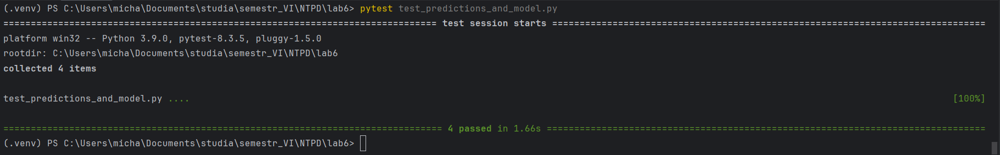
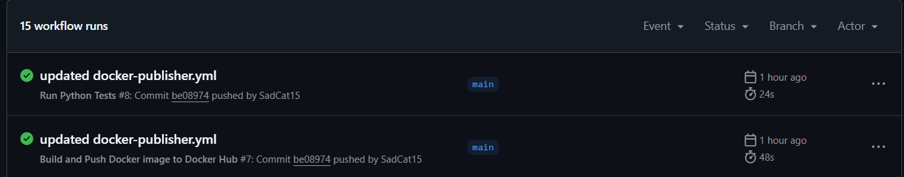
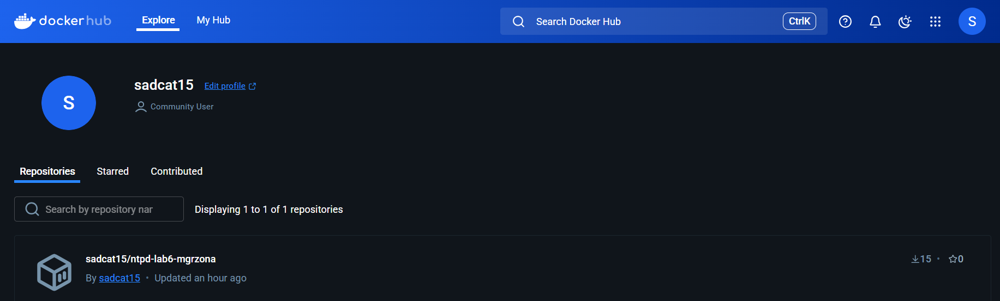

## Nowoczesne technologie przetwarzania danych, laboratorium 6
### Michał Grzona, grupa 3, indeks 121356
#### Zadanie 1: Przygotowanie repozytorium z przykładowym modelem ML
Pliki `app.py` i `model.py` są wzięte z poprzedniego laboratorium. W pliku `app.py` dodałem endpoint zwracający dokładnosć (accuracy) modelu. Za pierwszym uruchomieniem utworzy się prosty model LogisticRegression i zostanie zapisany w pliku `mdoel.pkl`.  
Utworzyłem plik `test_predicitons_and_model.py` i zawarłem w nim testy jednostkowe.

#### Zadanie 2: Konfiguracja GitHub Actions do automatycznego testowania
Utworzyłem GitHub Actions, które przeprowadzają testy jednostkowe i pobierają zależnośći z pliku `requierements.txt`.
#### Zadanie 3: Automatyczne budowanie obrazu Dockera i jego publikacja (opcjonalne / zaawansowane)
Utworzyłem GitHub Actions, które tworzy docker image na podstawie mojego Dockerfile i udostępnia je na DockerHub.

